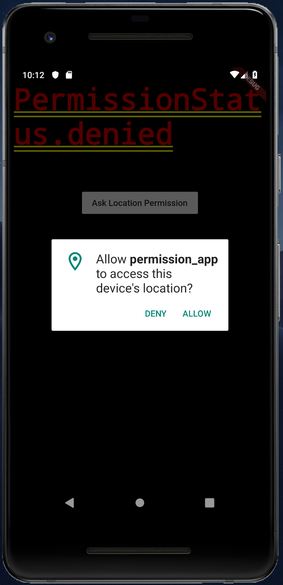
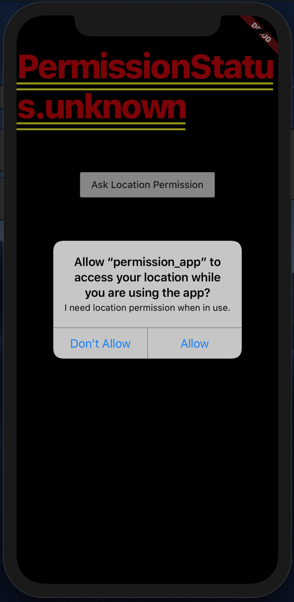

# permission_app

A Flutter app that checks and asks for permissions at runtime.

Video tutorials:
* [Ask Location Permission at Runtime](https://youtu.be/fNklvY1FEao)
* [Track App Lifecycle (Check Permission on Resume)](https://youtu.be/m_lDo-tcoBE)

Screenshots:

